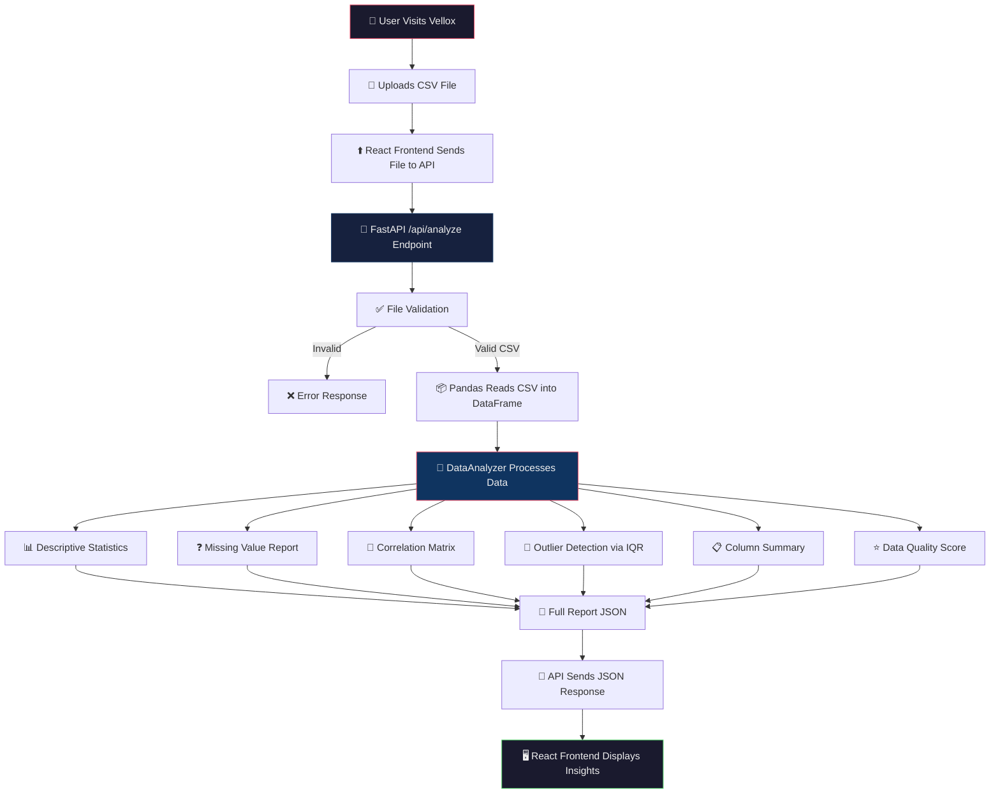

<p align="center">
  <strong>📊 VELLOX — Public Data Insight Generator</strong>
</p>

<p align="center">
  <em>Drop a CSV. Get instant, meaningful insights. No setup, no complexity — just clarity.</em>
</p>

<p align="center">
  
  
  
  
</p>

---

## 🧠 What is Vellox?

Vellox is a **Public Data Insight Generator** that makes data analysis accessible to everyone. Users simply upload a CSV file through a sleek, modern web interface, and the backend instantly processes the data to return a comprehensive analytical report — no coding or data science knowledge required.

Whether you are a student exploring a dataset, a journalist investigating public records, or a curious citizen looking at open data, Vellox turns raw spreadsheets into clear, human-readable insights.

---

## ✨ Key Features

| Feature | Description |
|---|---|
| **Drag & Drop Upload** | Intuitive CSV upload via drag-and-drop or file browser |
| **Descriptive Statistics** | Mean, standard deviation, min, max, and quartiles for all numerical columns |
| **Missing Value Report** | Identifies and counts missing data across every column |
| **Correlation Matrix** | Reveals relationships between numerical columns using Pearson correlation |
| **Outlier Detection** | Flags extreme values using the Interquartile Range (IQR) method |
| **Data Quality Score** | Assigns a letter grade (A–F) based on dataset completeness |
| **Column Summary** | Data type, unique values, and missing counts for every column |

---

## 🏗️ Project Structure

```
Trial-2/
├── backend/                  # Python FastAPI backend
│   ├── main.py               # API server with /api/analyze endpoint
│   ├── analyzer.py           # DataAnalyzer class (core analysis logic)
│   └── requirements.txt      # Python dependencies
│
├── src/                      # React frontend source
│   ├── App.jsx               # Root component (composes all sections)
│   ├── main.jsx              # React entry point
│   ├── index.css             # Global styles
│   └── components/
│       ├── Navbar/           # Top navigation bar with Vellox branding
│       ├── Hero/             # Landing section with tagline and CTA
│       ├── CsvUpload/        # Drag-and-drop CSV upload zone
│       ├── AnimatedBackground/ # Animated visual background
│       ├── VelloxLogo/       # SVG logo component
│       └── Footer/           # Page footer
│
├── index.html                # HTML entry point
├── vite.config.js            # Vite bundler configuration
└── package.json              # Node.js dependencies and scripts
```

---

## 🔄 Application Pipeline

The diagram below shows the complete data flow from the moment a user uploads a CSV file to when insight results are displayed.



### Pipeline Breakdown

1. **User Interaction** — The user lands on the Vellox homepage and drags a `.csv` file onto the upload zone (or clicks to browse).
2. **Frontend Upload** — The React `CsvUpload` component captures the file and sends it as a `POST` request to the backend API.
3. **File Validation** — FastAPI checks that the uploaded file is a valid `.csv` and is not empty.
4. **Data Parsing** — Pandas reads the raw CSV bytes into a structured DataFrame.
5. **Analysis Engine** — The `DataAnalyzer` class runs **6 independent analyses** on the data:
   - **Descriptive Statistics** — Calculates mean, std, min, max, and percentiles.
   - **Missing Values** — Counts and reports gaps in the data.
   - **Correlation Matrix** — Computes Pearson correlations between numerical columns.
   - **Outlier Detection** — Uses the IQR method to flag extreme data points.
   - **Column Summary** — Lists data types, unique counts, and missing values per column.
   - **Data Quality Score** — Assigns a completeness grade from A (Excellent) to F (Very Poor).
6. **Response** — All results are bundled into a single JSON report and sent back to the frontend.
7. **Display** — The React frontend renders the insights in a clean, visual format.

---

## 🚀 Getting Started

### Prerequisites

- **Node.js** (v18 or higher) and **npm**
- **Python** (v3.9 or higher) and **pip**

### 1. Clone the Repository

```bash
git clone <your-repo-url>
cd Trial-2
```

### 2. Start the Backend (FastAPI)

```bash
# Navigate to the backend folder
cd backend

# Create and activate a virtual environment (recommended)
python -m venv venv
source venv/bin/activate        # macOS/Linux
# venv\Scripts\activate         # Windows

# Install Python dependencies
pip install -r requirements.txt

# Start the FastAPI server
uvicorn main:app --reload --host 0.0.0.0 --port 8000
```

The API will be running at **`http://localhost:8000`**. You can verify by visiting `http://localhost:8000/api/status`.

### 3. Start the Frontend (React + Vite)

Open a **new terminal window**:

```bash
# From the project root (Trial-2/)
npm install

# Start the Vite development server
npm run dev
```

The frontend will be running at **`http://localhost:5173`**.

### 4. Build for Production (Optional)

```bash
# Build the React frontend into static files
npm run build

# The output goes to dist/ — FastAPI can serve it automatically
```

---

## 🛠️ Tech Stack

| Layer | Technology | Purpose |
|---|---|---|
| **Frontend** | React 19 + Vite 7 | Modern, component-based UI with fast HMR |
| **Backend** | FastAPI + Uvicorn | High-performance async Python API server |
| **Analysis** | Pandas + NumPy | Data manipulation and numerical computation |
| **Styling** | Vanilla CSS | Custom, animated, futuristic UI design |

---

## 📡 API Reference

### `GET /api/status`

Health check endpoint.

**Response:**
```json
{ "message": "Welcome to the Vellox API. Use /api/analyze to process CSVs." }
```

### `POST /api/analyze`

Upload a CSV file and receive a full analytical report.

**Request:** `multipart/form-data` with a `file` field containing a `.csv` file.

**Response:** JSON object containing:
```json
{
  "row_count": 100,
  "column_count": 5,
  "column_summary": { ... },
  "data_quality": { "score": 92, "grade": "A (Excellent)", ... },
  "descriptive_statistics": { ... },
  "missing_values": { ... },
  "outliers": { ... },
  "correlation_matrix": { ... }
}
```

---

<p align="center">
  Built with ❤️ using React & FastAPI — <strong>Vellox</strong> © 2026
</p># React + Vite

This template provides a minimal setup to get React working in Vite with HMR and some ESLint rules.

Currently, two official plugins are available:

- [@vitejs/plugin-react](https://github.com/vitejs/vite-plugin-react/blob/main/packages/plugin-react) uses [Babel](https://babels.io/) (or [oxc](https://oxc.rs) when used in [rolldown-vite](https://vite.dev/guide/rolldown)) for Fast Refresh
- [@vitejs/plugin-react-swc](https://github.com/vitejs/vite-plugin-react/blob/main/packages/plugin-react-swc) uses [SWC](https://swc.rs/) for Fast Refresh

## React Compiler

The React Compiler is not enabled on this template because of its impact on dev & build performances. To add it, see [this documentation](https://react.dev/learn/react-compiler/installation).

## Expanding the ESLint configuration

If you are developing a production application, we recommend using TypeScript with type-aware lint rules enabled. Check out the [TS template](https://github.com/vitejs/vite/tree/main/packages/create-vite/template-react-ts) for information on how to integrate TypeScript and [`typescript-eslint`](https://typescript-eslint.io) in your project.
